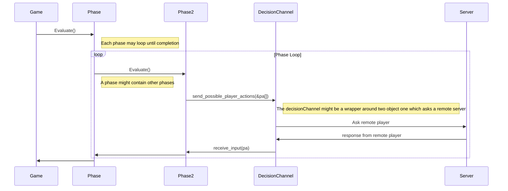
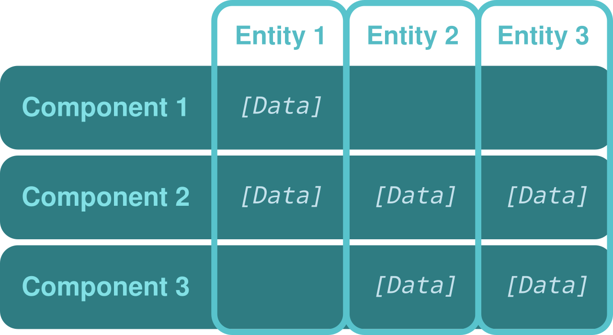

# Home Exam Olle Ronstad d7032e 2025

This is the home exam in the course d7032e at LTU

As our examiner said, AI is encouraged for this project due to time constraints and industry movement. Therefore, this project is also a learning moment for me, as I have never used AI before to write code—I have only used it for help with grammar and spelling.

Direct answer to the questions can be found in answer.md

<!-- cspell:ignore Vajb -->
## Analysis of Mr. VajbCruncher ai generated code

The analysis began by reading the requirements of the home exam.
Then an evaluation of the source began, things i noted can be seen in the following section

### Notes of the sourcecode

This section contains notes and observations during the review of VajbCruncher code

#### Server.java

The whole server appears to be a single class with 1369 lines of code.

- Communication with the clients is done using custom-crafted strings. Personally, I am against using strings for communication as they are not as structured as other forms of data. The exception is when structured objects are serialized to strings to be sent over the wire.

- There seems to be a number of "magic numbers," often 0 or 1. I would prefer that some of them be replaced with named constants such as FIRST_PLAYER and SECOND_PLAYER for actions between players.

- There is no encapsulation for the communication; the server class interacts with the socket directly. It would be better if the communication was encapsulated in its own class.

- The client is only a text connection to the server, which means the server processes logic that is client-specific. It would be better to either separate the client logic from the server or have the client be a more fully-fledged client with its own logic, or have a client class handled by the server to separate out server logic from client logic (according to the SRP principle).

- The server does not validate input from the client, which could lead to unexpected behavior or crashes. It would be better to implement some form of input validation or sanitization to ensure that the server can handle unexpected input gracefully. This is just bad code, not related to design principles.

- The server class has a lot of responsibilities: it handles the game logic, communication with the clients, and the game state. This violates the Single Responsibility Principle (SRP) and makes the code harder to maintain and understand.

- While I, as a Rustacean, do not like the exception system in Java and personally prefer errors as values but I see its appeal, but the server's error handling is poor. It often  continues execution, which can lead to unexpected behavior. It would be better to handle exceptions more gracefully and provide meaningful error messages to the clients. (A block around the run method captures all uncaught errors, regardless of what they are; at least it aborts execution.)

- The game loop have the phases hardcoded in the run method, which makes it difficult to change or extend the game logic. A state pattern would work nice here

- There are no unit tests, and it would be hard to implement them as the code does not have that in mind in its design.

- Ai mentioned that program does poor resource management, as it does not use try with resources or close connections explicitly (a win for rust's RAII).

#### Player.java

This class is 621 lines of code, yet again a monolith with multiple responsibilities.

- The class handles both local and bot players, which could be separated into different classes to adhere to the Single Responsibility Principle (SRP). The player should therefore be an interface.

- The class has a lot of duplicated code for handling player actions, which could be extracted into separate methods or classes to improve maintainability and readability. (this one was AI)

- The player class deals with interacting with the user, the user interface should be separated from the player logic. preferably with an interface to allow both for cli and gui clients.

- the resource pool in is hashmap with a string as a key, which makes the code prone to typos and errors, tuple or other classes would be better. While the hashmap is flexible, it is not something i would use due to the before mentioned reasons, i would prefer a more structured approach even if adding a resource would require a change to the tuple/class.

- the player as mentioned in server is "kept in the server" and not in the client, instead the class online player class exists, which inherits from player. I find inheritance a bad choice as inheritance makes it hard to understand its code as it is not clear what is inherited and what is not. Prefer composition over inheritance.

- Since there exist both player code in the client and the server there is a risk for them to desync from each other, fortunately the servers handles rng so it mimeses this risk

- Cards are stored with the player which menans they are duplicated on both server and client, risk for desync as well as risk for cheating as the player have control over their own data.

- as with the player cards the principality is both stored on the client and come with the same problems. more than that the principality is List List card, a more constrained data structure would be preferred

- SRP, map/principality should be its own interface

- SRP there exist helper method regarding string manipulation, should be separated, our better use an external library for task shush as this, no need to reinvent the wheel

- the cellTitle method have an horrible else if. Would prefer that display elements have these as have decorators
or that the card implements its on display function as a composite pattern

- There exists a `resourceToRegion` function in the player class, and a `REGION_TO_RESOURCE` hashmap in the server class. This is duplicate code; a solution might be to use helper functions or to represent regions as a class.

- some unnecessary function which ads extra layer of abstraction that i feel is unnecessary, the hand var is already public

#### Card.Java

another monolith with 650 lines

- There only exist one card class

- The structure of the data is recursive, a card contains many cards, there is no class for a deck or hand of cards, note only the top card contains other cards

- There exist functions named gs and gi, whit no documentation

- the card class contains a large amount of if else

## Design choices for the rust version

### Game loop



> **Note:**  
> This diagram does not illustrate how the server manages random events or dice rolls in relation to the rest of the system.  
> Since clients cannot be trusted to generate fair random numbers, all randomness is handled by the server to ensure game integrity.  
> This design choice increases coupling between the server and game logic, but is necessary for security.  
> Consequently, player actions are sent to the server for validation, rather than raw events, to prevent clients from manipulating the game state by submitting fake events.

### ECS, storing the game state

Since a requirement is easy extension of features combined with the multitude of cards with different effects, an ECS (Entity Component System) was chosen as the storage for game state.



One could imagine an ECS as similar to a SQL table, where entities are rows and components are columns.
Each phase can then query and modify the state without needing any advanced knowledge of the
structure of the data.

For example, in Rust using the `hecs` crate:

```rust
// Query all entities with a Card and Owner component
for (entity, (card, owner)) in world.query::<(&Card, &Owner)>().iter() {
    println!("Entity {:?} owns card: {}", owner, card.name);
}
```

A place where this shines is in the production phase: I can query for every card entity that matches the current dice roll and increment its resource value efficiently.

For example, from `production.rs`:

```rust
// Query all cards with Position, Card, Owner, ActivationDice, and ResourceStorage
world.query_mut::<(&Position, &Card, &Owner, &ActivationDice, &mut ResourceStorage)>()
    .into_iter()
    .filter(|(_, (pos, _, card_owner, act, _))| {
        **card_owner == owner && matches!(pos, Position::Board(_, _)) && act.0 == roll_result
    })
    .for_each(|(_, (_, _, _, _, storage))| {
        storage.increase();
    });
```

#### The position component

When designing how to store a card's position, one could have chosen to use separate components for each possible location (e.g., one for deck position, another for board position, etc.).

However, this approach allows for the possibility of representing an *illegal* state, where a card entity could have multiple position components at once. To avoid this, I decided to sacrifice some modifiability by using only a single position component, implemented as a Rust enum.

```rust
// From src/cards/cards.rs
#[derive(Debug, Clone, PartialEq, Eq)]
pub enum Position {
    Board(i32, i32),
    EventStack(u32),
    DrawStack1(u32),
    DrawStack2(u32),
    DrawStack3(u32),
    DrawStack4(u32),
}
```

This design makes illegal states unrepresentable, which is checked at compile time (no nasty runtime errors). As a side effect, this inability to represent illegal states makes the program more robust and modifiable, since it is easier to write error-free code.

#### The Box dyn Action Component

This is not yet implemented—40 hours is not enough for this exam, so the text is written as if it did exist.

Some cards have effects that need to be evaluated. This would be implemented as a component that can be queried and then evaluated dynamically.

For example, you could query all entities with a `Box<dyn ActionComponent>` and call their `eval` method:

```rust
// Pseudo-code: Query all entities with an ActionComponent and evaluate them
for (entity, action) in world.query_mut::<&mut Box<dyn ActionComponent>>().iter() {
    action.eval(entity, &mut world);
}

// Example: LumberHut action component
struct LumberHut;

impl ActionComponent for LumberHut {
    fn eval(&mut self, self_e: Entity, world: &mut World) {
        let position = world.query_one_mut::<&Position>(self_e).unwrap();
        // Query all adjacent cards and increase their resource
        world.query_mut::<(&Position, &Card, &Owner, &mut ResourceStorage)>()
            .into_iter()
            .filter(|(_, (pos, _, card_owner, _))| {
                // Check if card is adjacent to LumberHut
                is_adjacent(pos, position) && **card_owner == get_owner(self_e, world)
            })
            .for_each(|(_, (_, _, _, storage))| {
                storage.increase();
            });
    }
}

// Helper function (pseudo-code)
fn is_adjacent(pos1: &Position, pos2: &Position) -> bool {
    // Implement adjacency logic here
    true // placeholder
}
```


#### user_strategy, Deterministic State, and Multiplayer

*Not yet implemented, but design is outlined below.*

To ensure a deterministic game state, all randomness is only queried through the dice components. These dice either use the same seed or communicate with each other, guaranteeing that the game state remains consistent across all clients.

With a deterministic state, the only information that needs to be synchronized between players is their choices. This is achieved by wrapping a local `UserStrategy` and a remote strategy in a single struct. If it is the local player's turn, the wrapper routes decisions to the local strategy and forwards the choice to the remote player. If it is the remote player's turn, the wrapper listens for the choice made by the remote player.

Here is a cleaned-up example:

```rust
struct RemoteAndLocalWrapper<T: UserStrategy> {
    send: SocketSend,
    receive: SocketReceive,
    local: T,
}

impl<T: UserStrategy> UserStrategy for RemoteAndLocalWrapper<T> {
    fn get_user_decision(
        &self,
        decisions: Vec<Box<dyn DecisionChoice>>,
    ) -> Box<dyn DecisionChoice> {
        // Query the world to determine who has the player token
        if local_has_player_token() {
            let decision = self.local.get_user_decision(decisions);
            self.send.send(decision.clone());
            decision
        } else {
            self.receive.wait()
        }
    }
}
```

This approach ensures that only player choices are synchronized, while all other game logic remains deterministic and consistent across all clients.

#### Placing Cards

Placing cards is a bit more involved with the ECS solution. To find a valid spot, you need to query for settlements or cities, then check the positions above or below to determine where a card can be placed. Paying the cost is straightforward: you simply query the player entity to deduct the required resources. Since most cards have a low cost, this can be handled with 2–5 multiple choice questions for resource selection.

However, this approach does not scale well for expansions that might make the board larger or introduce cards with higher costs, which could require a large number of multiple choice questions.

Example (pseudo-code):

```rust
// Find all settlements/cities and collect valid placement choices
let mut choices = vec![];

for (_entity, (card, position, card_type)) in world.query::<(&Card, &Position, &CardType)>().iter() {
    if is_settlement_or_city(card_type) {
        // Check positions above/below for valid placement
        choices.extend(find_valid_spots(position));
    }
}

// Present choices to the user and get their decision
let selected_spot = user_strategy.get_user_decision(choices);
```

#### Loading Cards and Game Objects

Due to time constraints, a full implementation was not possible, but the following describes the intended end goal.

With ECS and the systems that operate on it, the design can be considered data-driven. The structure of ECS allows us to load an entity and add the relevant components listed in a data file, such as JSON.

For example, loading cards from a JSON file:

```rust
let entities: Vec<JsonCardComponent> = serde_json::from_str(include_str!("cards.json")).unwrap();
for e in entities {
    
    let mut entity_builder = EntityBuilder::new();
    
    for component in e {
        entity_builder.add(component)
    }
    world.spawn(entity.build());
}
```
